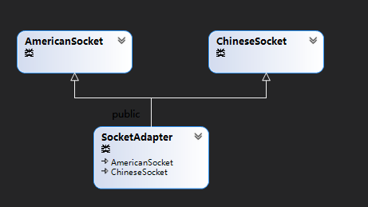
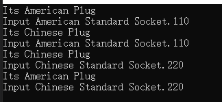

### 适配器模式

#### 设计思路

 	1. 采用双继承的方式分别继承着AmericanSocket、ChineseSocket
 	2. 设计的双向的适配器，里面有两个构造函数，分别对应着AmericanSocket，和ChineseSocket，均是只有一个参数的构造函数
 	3. 双向适配器Adapter需要分别实现AmericanSocket、ChineseSocket虚函数

#### 作业实现
        实现双向的适配器，同时增加了电压的转换

#### 类图

#### 结果

