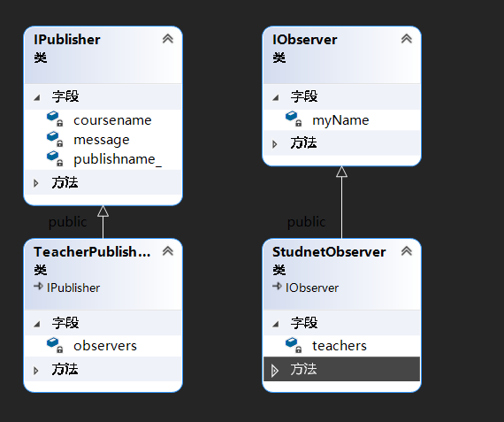

#### ObserverPattern 观察者模式
##### 设计思路
	观察者模式是一种行为型设计模式。主要的思路是在观察者里面维护一个被观察者的对象，被观察者里面
	同样也添加观察者对象。在观察者进行关注某个发布者，在观察者类里面来调用发布者，将其自身对象作为参数
        添加进发布者所维护的观察者列表中。
##### 作业要求
	要让学生和老师之间成为多对多的关系，一个学生可以关注多个老师，收到多个老师发布的作业，同样一个
	老师也可以被多个学生关注。
##### 设计具体流程
	首先，分别定义一个观察者和发布者的抽象类，分别让学生和老师类继承观察者，发布者的类，同时在学生类里面和老师类
	里面维护分别维护着unordered_set,为了防止添加重复的关注者和重复添加发布者。
	其次，给老师和学生创建名字，设置老师教授的课程，根据老师的名字来划分教授的课程。
        学生可以根据教师的名字查看是哪个发布者，也就是老师发布的消息
	最后，显示发布的信息，和老师的关注者等信息。

##### 类图

##### 结果
