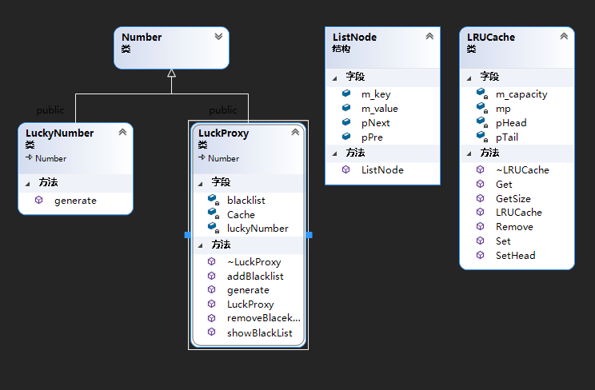
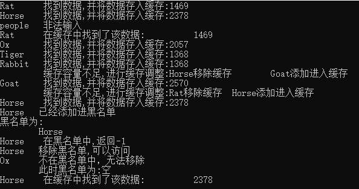

### ProxyPattern 代理设计模式
#### 设计思路
    首先是根据给出的一个LuckNumber,里面维护了一个Map，每种动物有不同的幸运数字。

    设计了LuckNumber的代理LuckProxy，用于给LuckNumber进行权限控制，延迟生成对象。

    同时设计了LRU用于缓存时候的优先级，对于经常访问的，对于经常访问的，将其放入到链表的头部
   
    如果设置的缓存空间满了，则将不经常访问的给移除链表。
#### LRU的设计思路
    LRU采用双向链表的形式，可以方便进行删除
    LRUCashe设计中内部维护着Map用来查找的便利
### 设计过程
        由于LuckNumber创建Map是在函数中的，我们不能修改原有对象的内容，只能是代理的形式来访问，
    不然每次的访问都需要创建重新创建Map，这是不需要的，
    LuckNumer的代理LuckProxy，用来权限控制，延迟生成，缓存存储

#### 主要功能
    LuckProxy 设置了一个黑名单，用于权限的控制，对于不想生成的则先过滤掉，同时对于已经访问过的并且存入到链表中的，也给忽略掉
    
    LuckProxy 里面维护着LRU对象，用于缓存

    LuckProxy 延迟创建对象
    显示黑名单，增加黑名单容量，显示黑名单等

#### 类图

#### 结果
