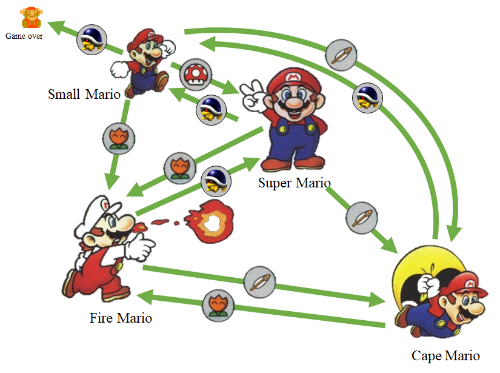
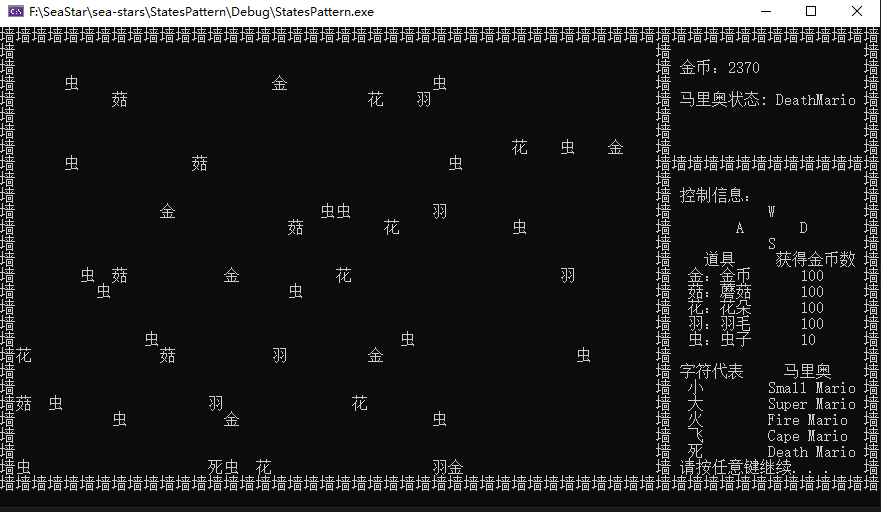
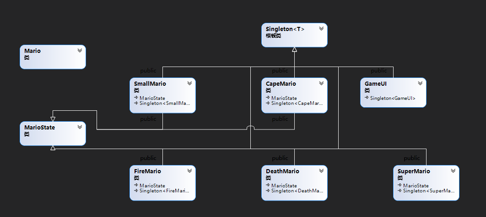

### StatesPattern 状态模式
#### 设计思路
	定义了一个单例模式，用来生成一个角色的不同状态，保证每种状态只有一个，以及界面也只有一个
	同时定义了一个Mario以及对单例和Mario双继承的各种角色状态的Mario。如下图

#### 各种状态转换描述
Small Mario

	Small Mario 碰到了怪物，就GameOver了，结束游戏
	Small Mario 碰到了羽毛，变成CapeMario
	Small Mario 碰到了花朵，变成FireMario
	Small Mario 碰到了蘑菇，变成了SuperMario
Super Mairo

	Super Mario 碰到了怪物，变成了Small Mario
	Super Mario 碰到了花朵，变成了Fire Mario
	Super Mario 碰到了羽毛，变成了Cape Mario
	Super Mario 碰到了蘑菇，仍然是Super Mario

Fire Mairo

	Fire Mario 碰到了怪物，变成了Super Mario
	Fire Mario 碰到了花朵，仍然是Fire Mario
	Fire Mario 碰到了羽毛，变成了Cape Mario
	Fire Mario 碰到了蘑菇，仍然是Fire Mario

Cape Mairo

	Cape Mario 碰到了怪物，变成了Small Mario
	Cape Mario 碰到了花朵，变成了Fire Mario
	Cape Mario 碰到了羽毛，仍然是Cape Mario
	Cape Mario 碰到了蘑菇，仍然是Cape Mario
只有是FireMario才可以发射子弹。
#### 设计UI界面
    只有是通过windows的一些命令行交互的使用。
    只要设计的思路：
    首先，Mario 类中维护着其可以转换Mario的状态，包括smallMario,SuperMario,FireMario,CapeMario,分别对各种Mario起不同的名字
            由于各种Mario都是单例的形式存在，则对可以根据各个Mairo的地址获取其名字。
    
    其次，GameUI类创建了一个Mairo，其初始值为SmallMario。使用一个二维数组来保存地图的信息。分别定义两个指针，分别来确定二维数组中道具，
        玩家，虫子的位置信息。然后根据时间来刷新屏幕，来确定每个道具，玩家，虫子的位置。
    
    最后，使用宏定义确定二维数组中每个位置所代表的信息，使用时间函数和随机函数来生成道具和虫子。
    
       （中文字符和英文的字符的编码方式不同，为了方便，因此都是用的是中文字符）
#### 详解

##### 宏定义 用来设置道具，地图大小，地图边界等

    #define high 28   //canvas high
    #define width 40 //canvas width
    #define border -1 //canvas border
    #define blank 0   //canvas black area
    #define player 1   //player
    #define bullet 2  // bullet
    #define worms 3   // worm
    #define destroy 4 //destrory worm
    #define mushroom 5 //mushroom
    #define conins 6  //coins
    #define flowers 7 //flowers
    #define feather 8 //feather
##### 初始化地图等信息

	void GameUI::init()
	{
		IsOver = 1;
		for (int i = 0; i < high + 2; i++)
		{ //init GUI
			for (int j = 0; j < width + 2; j++)
			{
				if ((i == 0 || i == high + 1) ||
					(j == 0 || j == width + 1))
				{
					canvas[i][j] = border;
				}
				else
					canvas[i][j] = blank;
			}
		}
	    pos_h = high / 2;             //init the player pos_h
	    pos_w = width / 2;            //init the player pos_w
	    canvas[pos_h][pos_w] = player; //
	    wormsnum = 3;                 //the worm
	
	    srand((unsigned)time(NULL));
	    interval = 4; //初始化时间间隔计数
	    itv_move = 10; //初始化敌机移动时间间隔
	    itv_new = 40; //初始化敌机刷新时间间隔
	}


##### 根据宏，分别给二维数组地图中的位置设置道具，地图等信息，用来实时刷新

			void GameUI::Show()
	{                
		HideCursor(); 
		gotoxy(1, 1); //flush screen
		for (int i = 0; i < high + 2; i++)
		{
			for (int j = 0; j < width + 2; j++)
			{
				if (canvas[i][j] == player)
				{ 
					std::cout<<getPlayerName();
				}
				else if (canvas[i][j] == bullet)
				{ 
					std::cout<<"哒";
				}
				else if (canvas[i][j] == worms)
				{ 
					std::cout<<"虫";
				}
				else if (canvas[i][j] == border)
				{ 
					std::cout<<"墙";
				}
				else if (canvas[i][j] == blank)
				{
					std::cout<<"  ";
				}
				else if (canvas[i][j] == destroy)
				{
					std::cout<<"死";
				}else if (canvas[i][j] == mushroom )
				{
					std::cout << "菇";
				}
				else if (canvas[i][j] == conins)
				{
					std::cout << "金";
				}else if (canvas[i][j] == flowers)
				{
					std::cout << "花";
				}
				else if (canvas[i][j] == feather)
				{
					std::cout << "羽";
				}
	            if (j == width + 1)
	            {
	                if ((i == 0 || i == high + 1) || i == high / 3)
	                {
	                    for (int k = 0; k < W_width / 2 - width - 2; k++)
	                    {
	                        std::cout<<"墙";
	                    }
	                }
	                if (i != 0)
	                {
	                    gotoxy(W_width - 1, i);
	                    std::cout<<"墙";
	                }
	            }
	        }
	        std::cout<<std::endl;
	    }
	    SetConsoleMessage();
	    }
##### 处理输入事件

​	按键使用的是Window提供的，_kbhit()，某个按键被按下，时候相应的键为小于0，使用SetState分别来改变player的移动，记录到地图中。


```
void GameUI::UpdateInput()
{                                     
	short key_W = GetKeyState('W'),    
		key_S = GetKeyState('S'),      
		key_A = GetKeyState('A'),      
		key_D = GetKeyState('D'),      
		key_attack = GetKeyState(' '); 
	if (_kbhit())
	{ 
		if (key_W < 0)
		{ 
			if (pos_h > 1)
			{
				canvas[pos_h][pos_w] = blank;
				SetState(--pos_h, pos_w);
			}
		}
		if (key_S < 0)
		{ 
			if (pos_h < high)
			{
				canvas[pos_h][pos_w] = blank;
				SetState( ++pos_h, pos_w);
			}
		}
		if (key_A < 0)
		{ 
			if ( pos_w >1)
			{
				canvas[pos_h][pos_w] = blank;
				SetState(pos_h,--pos_w);
			}
		}
		if (key_D < 0)
		{ 
			if (pos_w < width)
			{ 
				canvas[pos_h][pos_w] = blank;
				SetState(pos_h,++pos_w);	
            }
        }
        if (key_attack < 0)
        { 
            if ("FireMario"==mario->getStateName())
            {
                if (pos_h > 1 && pos_w <= width)
                    canvas[pos_h - 1][pos_w] = bullet;
            }
        }
    }
}
```


##### 非输入事件

​	对于非输入的事件，首先是采用了一个临时的的数组来存储上一次的信息，然后遍历该数组，预判性的来处理，对原始地图进行赋值，进行i，j与i-1，j位置道具，虫子的判断，
​	如果是虫子，且当时为SamllMario，则死亡，如果是虫子，是其他的Mario，则按照上图的转换进行，如果是其他道具，则处理相应的处理流程。

	void  GameUI::UpdateNormal()
	{                                  //update the screen
		int temp[high + 2][width + 2]; //save the original array
		for (int i = 1; i <= high; i++)
		{
			for (int j = 1; j <= width; j++)
			{
				temp[i][j] = canvas[i][j];
			}
		}
		//Iterate through the temporary array to modify the canvas
		for (int i = 1; i <= high; i++)
		{ 
			for (int j = 1; j <= width; j++)
			{
				if (temp[i][j] == worms && interval % itv_move == 0)
				{ //worms current position  
					canvas[i][j] = blank;
					if (temp[i + 1][j] == bullet)
					{ //worms is bulleted 
						canvas[i + 1][j] = blank;
						mario->SetCoin(10);
						std::cout<<"\a";
					}else if (i < high)
					{
						canvas[i + 1][j] = worms;
					}
	
					if (i + 1 == pos_h && j == pos_w)
					{ 
					if ("SmallMario" ==mario->getStateName())
					{
						canvas[i + 1][j] = destroy;
						IsOver = 0;
						mario->getStateName();
					}
					else
					{
						canvas[i + 1][j] = blank;
						mario->GotMonster();
						canvas[i + 1][j] = player;
					}
				}
			}
			else if(temp[i][j] == mushroom && interval % itv_move == 0)
			{
				canvas[i][j] = blank;
				if (i < high)
				{
					canvas[i + 1][j] = mushroom;
				}
				if (i + 1 == pos_h && j == pos_w)
				{ 
					canvas[i + 1][j] = mushroom;
					mario->GotMushroom();
					canvas[i + 1][j] = player;
				}
			}
			else if (temp[i][j] == flowers && interval % itv_move == 0)
			{
				canvas[i][j] = blank;
				if (i < high)
				{
					canvas[i + 1][j] = flowers;
				}
				if (i + 1 == pos_h && j == pos_w)
				{ 
					canvas[i + 1][j] = flowers;
					mario->GotFireFlower();
					canvas[i + 1][j] = player;
				}
			}else if (temp[i][j] == feather && interval % itv_move == 0)
			{
				canvas[i][j] = blank;
				if (i < high)
				{
					canvas[i + 1][j] = feather;
				}
				if (i + 1 == pos_h && j == pos_w)
				{ 
					canvas[i + 1][j] = feather;
					mario->GotFeather();
					canvas[i + 1][j] = player;
				}
			}
			else if (temp[i][j] == conins && interval % itv_move == 0)
			{
				canvas[i][j] = blank;
				if (i < high)
				{
					canvas[i + 1][j] = conins;
				}
				if (i + 1 == pos_h && j == pos_w)
				{ 
					canvas[i + 1][j] = feather;
					mario->SetCoin(100);
					canvas[i + 1][j] = player;
				}
			}
			if (temp[i][j] == bullet)
			{ 
				//attack the worms 
				canvas[i][j] = blank;
				if (temp[i - 1][j] == worms)
				{ 
					canvas[i - 1][j] = blank;
					mario->SetCoin(10);
					std::cout<<"\a";
				}
				else if (temp[i - 1][j] !=blank)
				{
					
				}
				else if (i > 1)
				{
					canvas[i - 1][j] = bullet;
				}
				
				}
			}	
	    }
	    SetRandom();
	}
#### 结果

 

#### 设计类图

​    

#### 特色
	游戏具有可玩性，有处理的状态的变换